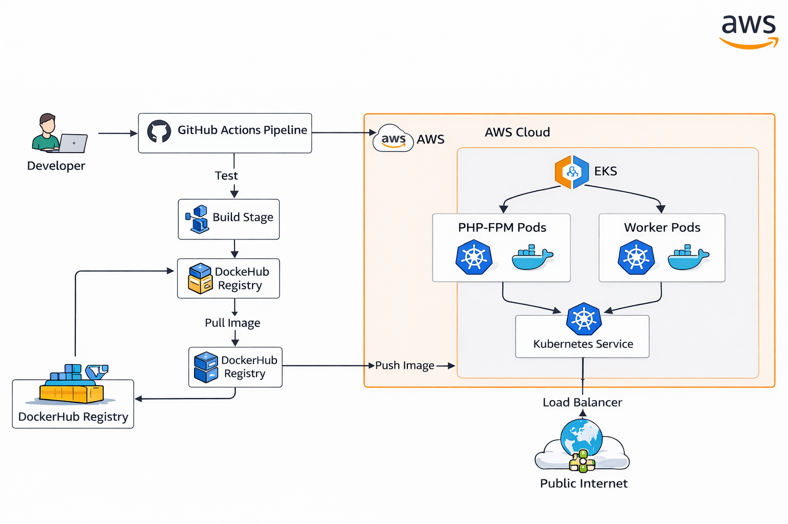

# Innoscripta DevOps–Laravel 10
<p align="center">
  
</p>


## Overview

This repository contains a **production‑ready DevOps implementation** for the Laravel 10 boilerplate application provided in the Innoscripta DevOps case study.

The focus of this task is **infrastructure, deployment automation, and CI/CD best practices**, not application feature development.

The solution includes:

* Infrastructure as Code using **Terraform** (AWS VPC, EKS, IAM)
* Containerization using **Docker**
* Kubernetes deployment using **Helm**
* **CI/CD pipeline** with test, build, and deploy stages
* Public application exposure via AWS LoadBalancer

---

## Infrastructure – Terraform

Terraform is used to define AWS infrastructure in a **modular and reusable** manner.

### Terraform Structure

```
terraform/
├── main.tf
├── provider.tf
├── variables.tf
├── outputs.tf
├── versions.tf
└── modules/
    ├── vpc/
    ├── eks/
    └── iam/
```

### Terraform Modules

* **VPC Module**
  Creates the VPC, subnets, and networking components required for EKS.

* **EKS Module**
  Provisions an Amazon EKS cluster using private subnets.

* **IAM Module**
  Creates an IAM user with permissions limited to **EKS and ECR**, which is used by CI/CD for deployments.

> Note: Creating actual AWS resources is optional as per the task instructions. The Terraform code is written as if a real EKS cluster and ECR repository exist.

### Terraform Commands

```bash
cd terraform
terraform init
terraform validate
terraform plan
```

---

## Docker Setup

A Dockerfile is provided to build the Laravel application image.

### Key Points

* PHP 8.2 FPM (Alpine)
* Required PHP extensions installed
* Supervisor used to manage processes
* Same image used for PHP‑FPM and worker containers

### Build Image Locally

```bash
docker build -t laravel-app -f Docker/Dockerfile .
```

---

## Local Development (docker‑compose)

For local development, the application can be run using Docker Compose.

```bash
docker-compose up --build
```

This starts the Laravel application and required services for local testing.

---

## Kubernetes Deployment – Helm

The application is deployed to Kubernetes using a Helm chart.

### Helm Structure

```
helm/laravel-app/
├── Chart.yaml
├── values.yaml
├── values-dev.yaml
├── values-staging.yaml
├── values-prod.yaml
└── templates/
    ├── deployment-php.yaml
    ├── deployment-worker.yaml
    ├── service.yaml
    ├── configmap.yaml
    ├── secret.yaml
    └── ingress.yaml
```

### Deployments

* **PHP‑FPM Deployment**
  Handles web requests.

* **Worker Deployment**
  Executes background jobs using:

  ```bash
  php artisan queue:work
  ```

### Environment‑Specific Configuration

Different environments are handled using separate values files:

| Environment | Values File         |
| ----------- | ------------------- |
| Development | values-dev.yaml     |
| Staging     | values-staging.yaml |
| Production  | values-prod.yaml    |

### Helm Validation (No Cluster Required)

```bash
helm template laravel helm/laravel-app \
  -f helm/laravel-app/values-prod.yaml
```

---

## Public Access

The application is exposed publicly using a Kubernetes Service of type **LoadBalancer**.

```yaml
service:
  type: LoadBalancer
  port: 80
```

On AWS EKS, this automatically provisions a public Elastic Load Balancer.

---

## CI/CD Pipeline

CI/CD is implemented using **GitHub Actions**.

### Pipeline Stages

1. **Test**
   Runs when a Pull Request is opened against the `main` branch. If tests fail, the PR cannot be merged.

2. **Build**
   Builds the Docker image and pushes it to **DockerHub**.

3. **Deploy**
   Deploys the application to EKS using Helm (or validates using `helm template` when no cluster is available).

### Branch‑Based Environments

| Branch      | Environment |
| ----------- | ----------- |
| development | Development |
| staging     | Staging     |
| main        | Production  |

### CI/CD Flow

* PR opened to `main` → **Test stage runs**
* Tests fail → Merge blocked
* PR merged → Build and Deploy stages run

---

## IAM & Security

* IAM user created with access limited to **EKS and ECR**
* No secrets committed to the repository
* Credentials managed using GitHub Actions Secrets

> In a real production setup, least‑privilege IAM policies and OIDC‑based authentication would be preferred.

---

## Possible Improvements (Optional)

* Docker image vulnerability scanning (Trivy)
* Helm rollback strategies
* HTTPS with Ingress and ACM
* GitHub Actions OIDC instead of long‑lived IAM keys

---

**Thank you for reviewing this case study.**
